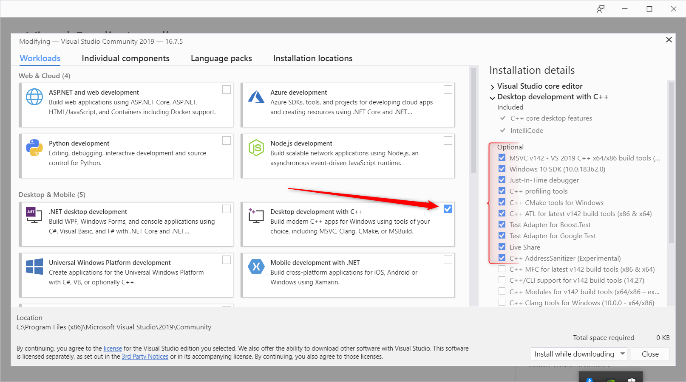
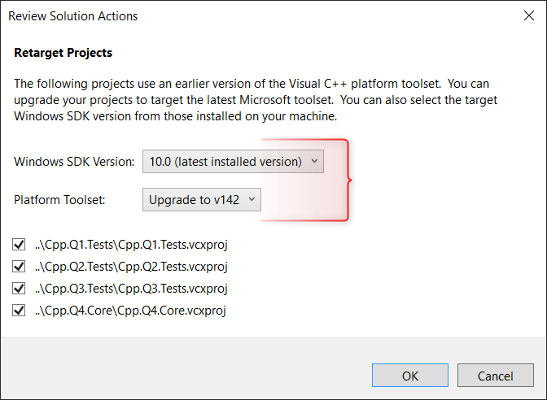
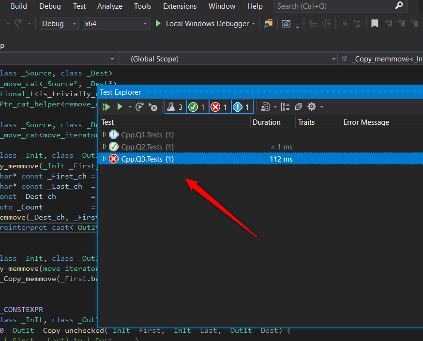

# Visual Studio 2019 Setup Help

Here are the prerequisites in VS 2019 to be able to work with the given solution and run/use the Unit Tests.

When running the installer, make sure you have the following components installed:

On our side, we are currently using VS 2017. This help is for VS 2019, assuming you are installing Visual Studio 2019 community.
The solution and projects provided in the test will tell you that the target and SDK are at an earlier version. You can upgrade and them as such:

When going in the menu `Test > Test Explorer`, you will be able to see the Unit Tests of the solution. When run individually, the first one (Q1) throws an exception. Your goal is to fix the code **NOT THE TEST**, to make the test pass.
Q4 is not present, your goal is to create it entirely.

Try making all tests pass successfully.
We will be available for questions and support during the test.
Good luck!